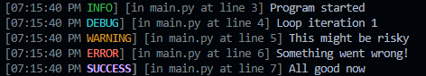

# Debug Logger

A lightweight Python logging utility with colorful console output.  
Includes timestamped log levels (INFO, DEBUG, WARNING, ERROR, SUCCESS) for easy debugging in the terminal.

## Features
- Colored log levels (green, cyan, yellow, red, magenta)
- 12-hour timestamp format
- Simple static methods for each log type
- Test function to preview all colors

## Installation
Clone the repository:

```bash
git clone https://github.com/Bhargavxyz738/debug.git
```
And just import it using `from debug import Debug`

## Usage
```python
from debug import Debug

Debug.info("Program started")
Debug.debug("Loop iteration 1")
Debug.warn("This might be risky")
Debug.err("Something went wrong!")
Debug.succ("All good now")
````

### Output Example

```
[08:20:01 PM INFO] Program started
[08:20:01 PM DEBUG] Loop iteration 1
[08:20:01 PM WARNING] This might be risky
[08:20:01 PM ERROR] Something went wrong!
[08:20:01 PM SUCCESS] All good now
```

## Preview


